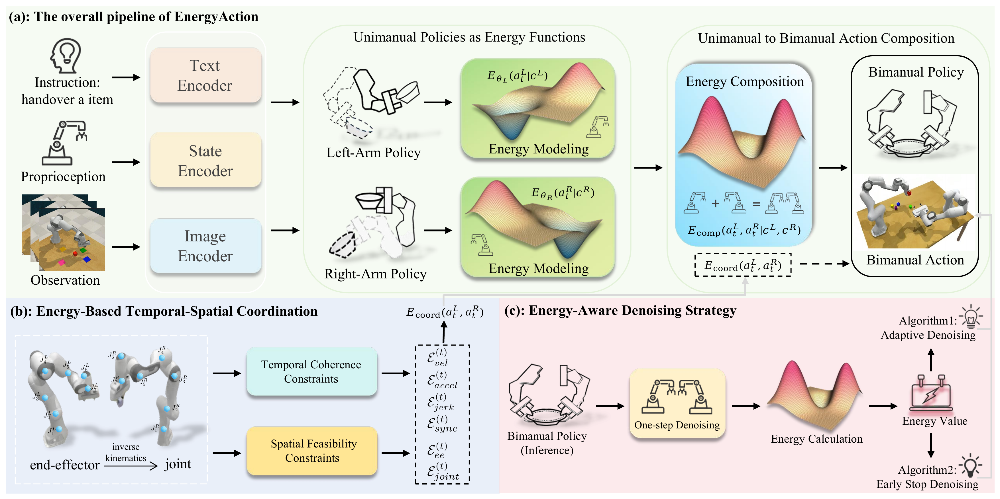

<div align="center">

# 🔋 EnergyAction: Unimanual to Bimanual Composition with Energy-Based Models (CVPR 2026)

</div>


### If you find this work useful for your research, please kindly cite our paper and star our repo.

## 📢 Updates

- [03/2026] 🔥 Code and pretrained models are released.
- [03/2026] 📄 <a href="[https://arxiv.org/abs/XXXX.XXXXX](https://arxiv.org/abs/2603.20236)">arXiv</a> paper released.](https://arxiv.org/abs/2603.20236)
## Introduction

We propose **EnergyAction**, a framework that compositionally transfers pre-trained unimanual manipulation policies to bimanual tasks via Energy-Based Models (EBMs). By modeling each arm's policy as an energy function and composing them through energy summation, EnergyAction generates coordinated dual-arm actions with temporal coherence and collision avoidance — requiring only minimal bimanual demonstration data. 
<div align="center">

</div>

## Installation
### 1. Clone this repository

```bash
git clone https://github.com/xxx/EnergyAction.git
cd EnergyAction
```

### 2. Create conda environment

```bash
conda create -n energyaction python=3.10 -y
conda activate energyaction
pip install -e .
```

### 3. Install additional packages

```bash
pip install torch torchvision open_clip_torch zarr einops setproctitle
```

### 4. Install CoppeliaSim (required for evaluation)

Online evaluation requires [CoppeliaSim](https://www.coppeliarobotics.com/) and [PyRep](https://github.com/stepjam/PyRep). Follow the PyRep installation guide to set up CoppeliaSim, then set the environment variables:

```bash
export COPPELIASIM_ROOT=/path/to/CoppeliaSim
export LD_LIBRARY_PATH=${LD_LIBRARY_PATH}:${COPPELIASIM_ROOT}
export QT_QPA_PLATFORM_PLUGIN_PATH=${COPPELIASIM_ROOT}
```


## Datasets

We use the **RLBench** benchmark with Peract2 data format stored in Zarr for efficient loading.

### Single-arm data (RLBench)

Used for Stage 1: pretraining the single-arm 3D Flow Actor backbone.

```bash
# Download single-arm RLBench training data
wget https://huggingface.co/katefgroup/3d_diffuser_actor/resolve/main/Peract_packaged.zip
unzip Peract_packaged.zip
rm Peract_packaged.zip

# Download single-arm RLBench evaluation data
wget https://huggingface.co/katefgroup/3d_flowmatch_actor/resolve/main/peract_test.zip
unzip peract_test.zip
rm peract_test.zip

# Convert to Zarr format
python data_processing/peract_to_zarr.py \
    --root <raw_single_arm_data_dir> \
    --tgt <zarr_output_dir>
```

### Bimanual data (RLBench2)

Used for Stage 2: training the EBM Bimanual Composer.

```bash
# Download bimanual-arm RLBench data (Peract format)
python scripts/rlbench/download_peract2.py --root <data_dir>

# (Optional) Generate data from scratch
bash data_generation/generate_data.sh

# Convert raw bimanual data to Zarr format
python data_processing/peract2_to_zarr.py \
    --root <raw_bimanual_data_dir> \
    --tgt <zarr_bimanual_output_dir>
```
<!--
## Training

The training pipeline consists of two stages:

<p align="center">
  <b>Stage 1 (Single-arm data)</b> → Pretrain single-arm 3D Flow Actor<br>
  ↓<br>
  <b>Stage 2 (Bimanual data)</b> → Train EBM Bimanual Composer with energy-based coordination
</p>

---

### Stage 1: Pretrain Single-Arm 3D Flow Actor (on RLBench single-arm data)

Train a single-arm `denoise3d` model with Rectified Flow on **single-arm** RLBench data. The trained checkpoint will serve as the pretrained backbone for both left and right arms in Stage 2.

```bash
# Basic usage
bash scripts/rlbench/train_single_arm.sh

# With nohup (recommended)
nohup bash scripts/rlbench/train_single_arm.sh > train_single_arm.log 2>&1 &
```

Before running, update the data paths in `scripts/rlbench/train_single_arm.sh`:
```bash
TRAIN_DATA_DIR="path/to/single_arm_zarr_data"
EVAL_DATA_DIR="path/to/single_arm_zarr_data"
```

The trained checkpoint will be saved to:
```
train_logs/Peract/denoise3d-Peract-C120-B64-lr1e-4-constant-H3-rectified_flow/best.pth
```

> **Note:** The output path is auto-generated from training hyperparameters. Check `train_single_arm.sh` for the exact `RUN_LOG_DIR` format.

Alternatively, you can skip Stage 1 and directly use our publicly released pretrained single-arm checkpoint (see [Pretrained Checkpoints](#pretrained-checkpoints) below).

---

### Stage 2: Train EBM Bimanual Composer (on RLBench2 bimanual data)

Train the EBM Bimanual Composer with energy-based coordination on **bimanual** data, initialized from the Stage 1 single-arm pretrained weights:

```bash
# Basic usage
bash scripts/rlbench/train_ebm_bimanual_composer.sh [experiment_name]

# With nohup (recommended)
nohup bash scripts/rlbench/train_ebm_bimanual_composer.sh my_experiment > my_experiment.log 2>&1 &
```

Before running, update the pretrained single-arm model paths in `scripts/rlbench/train_ebm_bimanual_composer.sh`:
```bash
# Point to the Stage 1 checkpoint (same checkpoint for both arms)
LEFT_PRETRAINED_PATH="path/to/single_arm_checkpoint.pth"
RIGHT_PRETRAINED_PATH="path/to/single_arm_checkpoint.pth"
```
-->
## Pretrained Checkpoints

We release all pretrained checkpoints on Hugging Face: 🤗 [mingchens/EnergyAction](https://huggingface.co/mingchens/EnergyAction)

| Checkpoint | Description | Size |
|:-----------|:------------|:-----|
| `pretrain_unimanual_checkpoint.pth` | Stage 1: Single-arm 3D Flow Actor | 421 MB |
| `20demo_checkpoint.pth` | Stage 2: EBM Bimanual Composer (20 demos) | 1.69 GB |
| `100demo_checkpoint.pth` | Stage 2: EBM Bimanual Composer (100 demos) | 1.69 GB |

```bash
# Download checkpoints (requires huggingface_hub)
pip install huggingface_hub

# Download all checkpoints
huggingface-cli download mingchens/EnergyAction --local-dir checkpoints/

# Or download individually
huggingface-cli download mingchens/EnergyAction pretrain_unimanual_checkpoint.pth --local-dir checkpoints/
huggingface-cli download mingchens/EnergyAction 100demo_checkpoint.pth --local-dir checkpoints/
```

- **pretrain_unimanual_checkpoint.pth**: Use as `LEFT_PRETRAINED_PATH` and `RIGHT_PRETRAINED_PATH` in Stage 2 training. You can skip Stage 1 entirely with this checkpoint.
- **20demo_checkpoint.pth**: EBM Bimanual Composer trained with 20 bimanual demonstrations per task.
- **100demo_checkpoint.pth**: EBM Bimanual Composer trained with 100 bimanual demonstrations per task.

## Evaluation

### Online Evaluation (RLBench + CoppeliaSim)

We evaluate on **13 bimanual tasks** in RLBench using CoppeliaSim simulation:

```bash
# Evaluate with experiment name (auto-finds best.pth)
bash scripts/rlbench/eval_ebm_bimanual_composer.sh my_experiment

# Evaluate with specific checkpoint
bash scripts/rlbench/eval_ebm_bimanual_composer.sh /path/to/checkpoint.pth

# With nohup (recommended for long evaluation)
nohup bash scripts/rlbench/eval_ebm_bimanual_composer.sh my_experiment > eval_my_experiment.log 2>&1 &
```

<details>
<summary><b>Evaluated Bimanual Tasks (13 tasks)</b></summary>

| Task | Task |
|------|------|
| `bimanual_push_box` | `bimanual_lift_ball` |
| `bimanual_dual_push_buttons` | `bimanual_pick_plate` |
| `bimanual_put_item_in_drawer` | `bimanual_put_bottle_in_fridge` |
| `bimanual_handover_item` | `bimanual_pick_laptop` |
| `bimanual_straighten_rope` | `bimanual_sweep_to_dustpan` |
| `bimanual_lift_tray` | `bimanual_handover_item_easy` |
| `bimanual_take_tray_out_of_oven` | |

</details>

## Project Structure

```
EnergyAction/
├── main.py                            # Entry point
├── setup.py                           # Package installation
├── modeling/
│   ├── ebm_compositionality/          # 🔑 Core EBM modules
│   │   ├── flow_to_energy.py          #   Flow Matching → Energy conversion
│   │   ├── energy_composer.py         #   E_left + E_right + E_coord composition
│   │   ├── ebm_bimanual_composer.py   #   Main EBM bimanual model
│   │   ├── bimanual_coordination_constraints.py  # Physics-informed constraints
│   │   └── panda_kinematics.py        #   Franka Panda robot kinematics
│   ├── encoder/                       # Vision-language encoders (CLIP backbone)
│   ├── noise_scheduler/               # DDPM / DDIM / Rectified Flow
│   ├── policy/                        # Base denoising policy networks
│   └── utils/                         # Transformer layers, attention, PE
├── datasets/                          # RLBench data loading (Zarr format)
├── utils/                             # Training loop, schedulers, EMA
├── pretrain_unimanual/                # Pretrained single-arm checkpoint
├── scripts/
│   └── rlbench/
│       ├── train_single_arm.sh        # Stage 1: Single-arm training
│       ├── train_ebm_bimanual_composer.sh  # Stage 2: EBM bimanual training
│       └── eval_ebm_bimanual_composer.sh   # Online evaluation
├── online_evaluation_rlbench/         # CoppeliaSim online evaluation
├── data_processing/                   # Raw data → Zarr conversion
├── data_generation/                   # RLBench data generation
└── instructions/                      # Task language instructions
```

## Acknowledgement

Our implementation is mainly based on the following codebases. We gratefully thank the authors for their wonderful works.

- [3D Diffuser Actor (3DFA)](https://github.com/nickgkan/3d_diffuser_actor)
- [Peract2](https://github.com/markusgrotz/peract_bimanual)

## Citation

```bibtex
@inproceedings{energyaction2026,
  title={EnergyAction: Energy-Based Compositional Flow Matching for Bimanual Manipulation},
  author={Mingchen Song, Xiang Deng, Jie Wei,  Dongmei Jiang,  Liqiang Nie, Weili Guan},
  booktitle={},
  year={2026}
}
```

